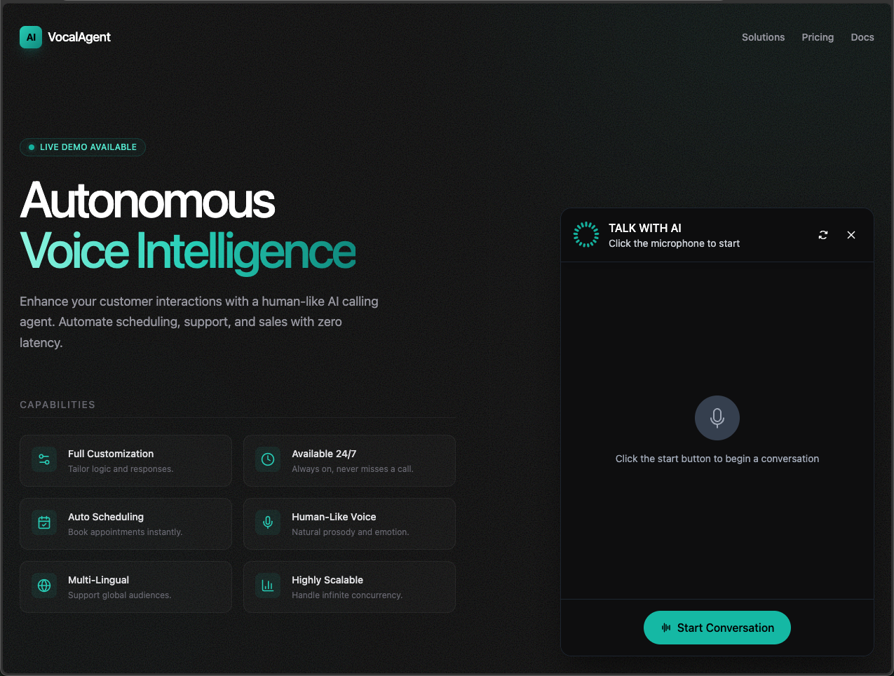

# AI Calling Agent UI

This project is a simple, beautiful user interface to demonstrate an AI Calling Agent. The UI is designed to be clean and modern, with a gradient background and a clear feature list.

## Screenshots

Here is a preview of the user interface.

**Main View:**

**Chat Window Open:**

## Features

- **Gradient Background:** A visually appealing gradient background using the accent colors of the AI agent widget.
- **Left-Aligned Content:** The main content, including the title, description, and feature list, is aligned to the left to ensure it remains visible when the chat widget is open.
- **Feature Showcase:** A styled list highlights the key features of the AI Calling Agent:
    - Fully Customization
    - Available 24/7
    - Schedule Appointment Automatically
    - Scalable
    - Multi Linguable
    - Human Like Professional Voice
    - Fixed Standard Call

## How to Use

Simply open the `index.html` file in your web browser to view the UI and interact with the AI Calling Agent.
